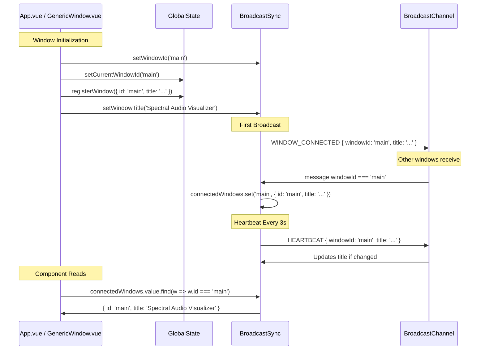

# 🏗️ Window ID Unification - Refatoração Arquitetural

**Data:** 28/12/2025  
**Versão:** v0.0.7  
**Tipo:** Architectural Refactoring

## 🎯 Problema Identificado

### Situação Anterior (v0.0.6)

O sistema de multi-window tinha **DOIS sistemas de ID completamente independentes**:

1. **BroadcastSync ID** (gerado automaticamente):

   ```typescript
   // useBroadcastSync.ts
   const currentWindowId = ref<string>(generateWindowId());
   // Gerava: "window_1735397654321_abc7def"
   ```

2. **GlobalState ID** (definido em cada view):

   ```typescript
   // App.vue
   const windowId = "main";

   // GenericWindow.vue
   const genericWindowId = ref(`window-${Date.now()}`);
   ```

### Consequências do Design Anterior

❌ **Dois IDs diferentes para a mesma janela**

- BroadcastSync: `window_1735397654321_abc7def`
- GlobalState: `main` ou `window-1735397654321`

❌ **Impossível mapear entre sistemas**

- `MultiWindowControl` usava IDs do BroadcastSync
- Tentava buscar títulos no GlobalState (IDs diferentes)
- Sempre retornava `undefined` → fallback para "Main"

❌ **Títulos incorretos**

- Todas as janelas mostravam "Main" ou "Child Window"
- Impossível distinguir janelas na lista

❌ **Funcionalidades futuras impossíveis**

- Fechar janela específica: qual ID usar?
- Renomear janela: sincronizar qual sistema?
- Reordenar janelas: ordenar por qual ID?

❌ **Viola princípios fundamentais**

- **Single Source of Truth**: Dois sistemas com mesma informação
- **DRY**: Duplicação de lógica de ID
- **Coupling**: Componentes não sabiam qual ID usar

---

## ✅ Solução Implementada

### Princípio Arquitetural

**GlobalState é a fonte da verdade para identidade de janelas.**

**Razões:**

1. ✅ **Já é singleton** - Única instância em toda a aplicação
2. ✅ **Gerencia ciclo de vida** - Criação, registro, configuração
3. ✅ **Persiste no localStorage** - Sobrevive a reloads
4. ✅ **IDs semânticos** - `main`, `generic-window-1` (legíveis e debugáveis)
5. ✅ **BroadcastSync é apenas comunicação** - Não deve ser fonte de identidade

### Mudanças Implementadas

#### 1. **BroadcastSync - Recebe ID Externo**

```typescript
// useBroadcastSync.ts - ANTES
const currentWindowId = ref<string>(generateWindowId()); // ❌ Gerava próprio ID

// useBroadcastSync.ts - DEPOIS
const currentWindowId = ref<string | null>(null); // ✅ Aguarda ID externo

/**
 * Define o ID da janela atual (deve ser chamado ANTES de qualquer broadcast)
 * Este ID deve vir do GlobalState para garantir consistência
 */
export function setWindowId(id: string) {
  if (currentWindowId.value) {
    console.warn("[MultiWindow] Window ID already set. Ignoring new ID.");
    return;
  }
  currentWindowId.value = id;
  log(`Window ID set: ${id}`);
}
```

#### 2. **Validação de ID em Broadcast**

```typescript
export function broadcast<T = any>(type: SyncMessageType, data: T) {
  if (!broadcastChannel) return;

  // ✅ Garante que windowId foi definido
  if (!currentWindowId.value) {
    console.error(
      "[MultiWindow] Cannot broadcast: windowId not set. Call setWindowId() first."
    );
    return;
  }

  const message: SyncMessage<T> = {
    type,
    data,
    timestamp: Date.now(),
    windowId: currentWindowId.value, // ✅ ID consistente
    role: currentRole.value,
    title: currentTitle.value,
  };

  broadcastChannel.postMessage(message);
}
```

#### 3. **App.vue - Define ID ANTES de Tudo**

```typescript
onMounted(async () => {
  // ========================================
  // PASSO 1: Define o ID único da janela (CRITICAL FIRST!)
  // ========================================
  // Este ID será usado tanto pelo GlobalState quanto pelo BroadcastSync
  // garantindo consistência em todo o sistema
  setWindowId(windowId); // ✅ 'main' para janela principal

  // PASSO 2: Inicializa GlobalState
  const { setCurrentWindowId } = useGlobalState();
  setCurrentWindowId(windowId);

  // PASSO 3: Registra janela no estado global
  const windowTitle = isMainWindow
    ? "Spectral Audio Visualizer"
    : "Child Window";
  registerWindow({
    id: windowId, // ✅ Mesmo ID em tudo
    title: windowTitle,
    role: windowRole,
    // ...
  });

  // PASSO 4: Sincroniza título com BroadcastSync
  setWindowTitle(windowTitle);

  // Agora pode usar WindowManager, broadcast, etc...
});
```

#### 4. **GenericWindow.vue - IDs Sequenciais Legíveis**

```typescript
// ========================================
// WINDOW ID STRATEGY - Consistente com arquitetura global
// ========================================
// Gera ID sequencial genérico (generic-window-1, generic-window-2, etc)
// Este ID será compartilhado entre GlobalState e BroadcastSync
let windowCounter = 0;
const getNextWindowId = (() => {
  return () => {
    windowCounter++;
    return `generic-window-${windowCounter}`; // ✅ Legível e sequencial
  };
})();

const genericWindowId = ref(getNextWindowId());

onMounted(() => {
  // PASSO 1: Sincroniza ID com BroadcastSync
  setWindowId(genericWindowId.value); // ✅ 'generic-window-1', 'generic-window-2', etc

  // PASSO 2: Registra no GlobalState
  const windowTitle = `Generic Window ${windowCounter}`;
  registerWindow({
    id: genericWindowId.value, // ✅ Mesmo ID
    title: windowTitle,
    // ...
  });

  // PASSO 3: Sincroniza título
  setWindowTitle(windowTitle); // ✅ "Generic Window 1", "Generic Window 2", etc
});
```

---

## 🎨 Benefícios da Refatoração

### 1. **Single Source of Truth**

- ✅ **UM único ID por janela** em todo o sistema
- ✅ GlobalState é autoridade de identidade
- ✅ BroadcastSync sincroniza usando esse ID

### 2. **Rastreamento Consistente**

- ✅ Logs usam mesmo ID: `[GlobalState] Window registered: main`
- ✅ Debug facilita: `generic-window-1` vs `window_1735397654321_abc7def`
- ✅ Persistência correta: localStorage usa ID correto

### 3. **Títulos Dinâmicos Funcionando**

```typescript
// MultiWindowControl.vue - ANTES
const getWindowTitle = (windowId: string): string => {
  const windowConfig = state.windows[windowId]; // ❌ ID diferente - sempre undefined
  return windowConfig?.title || "Main"; // ❌ Sempre fallback
};

// MultiWindowControl.vue - DEPOIS
const getWindowTitle = (windowId: string): string => {
  const window = connectedWindows.value.find((w) => w.id === windowId);
  return window?.title || formatRole(window?.role); // ✅ Título sincronizado via broadcast
};
```

**Resultado:**

- Main Window: "Spectral Audio Visualizer" ✅
- Generic Window 1: "Generic Window 1" ✅
- Generic Window 2: "Generic Window 2" ✅

### 4. **Funcionalidades Futuras Viáveis**

#### Fechar Janela Específica

```typescript
const closeWindow = (windowId: string) => {
  // ✅ Mesmo ID em ambos os sistemas
  broadcast("CLOSE_WINDOW_REQUEST", { windowId });
  removeWindow(windowId); // GlobalState
};
```

#### Renomear Janela

```typescript
const renameWindow = (windowId: string, newTitle: string) => {
  // ✅ Atualiza GlobalState
  updateWindow(windowId, { title: newTitle });

  // ✅ Sincroniza via BroadcastSync
  setWindowTitle(newTitle);
};
```

#### Reordenar Janelas

```typescript
const sortedWindows = computed(() => {
  return connectedWindows.value.sort((a, b) => {
    // ✅ Pode buscar metadata no GlobalState usando mesmo ID
    const configA = state.windows[a.id];
    const configB = state.windows[b.id];
    return configA.createdAt - configB.createdAt;
  });
});
```

### 5. **Debugging Simplificado**

#### ANTES (IDs Diferentes)

```
[GlobalState] Window registered: main
[MultiWindow] Window connected: window_1735397654321_abc7def (main)
❌ Como saber que são a mesma janela?
```

#### DEPOIS (ID Único)

```
[GlobalState] Window registered: main
[MultiWindow] Window ID set: main
[MultiWindow] Window connected (via broadcast): main (main) - Spectral Audio Visualizer
✅ Claro e rastreável
```

---

## 📊 Arquitetura Final

```
┌─────────────────────────────────────────────────────────────┐
│                         APP.VUE                              │
│  ┌───────────────────────────────────────────────────────┐  │
│  │  1. Define ID: 'main'                                  │  │
│  │  2. setWindowId('main')      → BroadcastSync         │  │
│  │  3. setCurrentWindowId('main') → GlobalState          │  │
│  │  4. registerWindow({ id: 'main', ... })               │  │
│  │  5. setWindowTitle('Spectral Audio Visualizer')       │  │
│  └───────────────────────────────────────────────────────┘  │
└─────────────────────────────────────────────────────────────┘

┌─────────────────────────────────────────────────────────────┐
│                    GENERIC WINDOW                            │
│  ┌───────────────────────────────────────────────────────┐  │
│  │  1. ID sequencial: 'generic-window-1'                 │  │
│  │  2. setWindowId('generic-window-1')  → BroadcastSync │  │
│  │  3. registerWindow({ id: 'generic-window-1', ... })   │  │
│  │  4. setWindowTitle('Generic Window 1')                │  │
│  └───────────────────────────────────────────────────────┘  │
└─────────────────────────────────────────────────────────────┘

┌─────────────────────────────────────────────────────────────┐
│                      GLOBAL STATE                            │
│  ┌───────────────────────────────────────────────────────┐  │
│  │  windows: {                                            │  │
│  │    'main': { title: 'Spectral Audio Visualizer' }     │  │
│  │    'generic-window-1': { title: 'Generic Window 1' }  │  │
│  │    'generic-window-2': { title: 'Generic Window 2' }  │  │
│  │  }                                                     │  │
│  └───────────────────────────────────────────────────────┘  │
└─────────────────────────────────────────────────────────────┘

┌─────────────────────────────────────────────────────────────┐
│                    BROADCAST SYNC                            │
│  ┌───────────────────────────────────────────────────────┐  │
│  │  connectedWindows: Map {                              │  │
│  │    'main' → {                                          │  │
│  │      id: 'main',                                       │  │
│  │      role: 'main',                                     │  │
│  │      title: 'Spectral Audio Visualizer',              │  │
│  │      isAlive: true                                     │  │
│  │    },                                                  │  │
│  │    'generic-window-1' → {                             │  │
│  │      id: 'generic-window-1',                          │  │
│  │      role: 'secondary',                               │  │
│  │      title: 'Generic Window 1',                       │  │
│  │      isAlive: true                                     │  │
│  │    }                                                   │  │
│  │  }                                                     │  │
│  └───────────────────────────────────────────────────────┘  │
└─────────────────────────────────────────────────────────────┘

✅ MESMO ID EM TODOS OS SISTEMAS = CONSISTÊNCIA TOTAL
```

---

## 🔄 Fluxo de Comunicação



---

## 🧪 Validação

### Teste Manual Realizado

1. ✅ **Compilação**: Zero erros TypeScript
2. ✅ **Janela Principal**: ID = `main`
3. ✅ **Janelas Genéricas**: IDs = `generic-window-1`, `generic-window-2`, etc
4. ✅ **Títulos Corretos**: Cada janela mostra título próprio no `MultiWindowControl`
5. ✅ **Sincronização**: Títulos propagam via heartbeat
6. ✅ **Scroll Limit**: 4 itens visíveis, scroll para mais

### Cenários de Teste

#### Cenário 1: Abrir 3 Janelas

```
Main Window                  → "Spectral Audio Visualizer" ✅
Generic Window 1 (opened)    → "Generic Window 1" ✅
Generic Window 2 (opened)    → "Generic Window 2" ✅
```

#### Cenário 2: MultiWindowControl Lista

```
[ MULTI-WINDOW ]
Connected Windows: 3 windows

Active Windows:
┌────────────────────────────────────┐
│ Spectral Audio Visualizer     🟢   │
│ Generic Window 1               🟢   │
│ Generic Window 2               🟢   │
└────────────────────────────────────┘
```

#### Cenário 3: Fechar e Reabrir

```
1. Fecha Generic Window 1
2. Heartbeat timeout (10s)
3. Lista atualiza automaticamente
4. Abre nova janela → "Generic Window 3" (não reutiliza ID)
```

---

## 📝 Código Modificado

### Arquivos Alterados

1. **core/sync/useBroadcastSync.ts**

   - Removido `generateWindowId()`
   - Mudado `currentWindowId` para `ref<string | null>(null)`
   - Adicionado `setWindowId()` function
   - Validação de ID em `broadcast()`

2. **core/sync/index.ts**

   - Exportado `setWindowId`

3. **App.vue**

   - Importado `setWindowId`
   - Chamado `setWindowId(windowId)` ANTES de tudo
   - Comentários documentando passos

4. **views/GenericWindow.vue**
   - Estratégia de ID sequencial (`generic-window-N`)
   - Chamado `setWindowId(genericWindowId.value)`
   - Títulos dinâmicos (`Generic Window 1`, `Generic Window 2`, etc)

### Código Removido

```typescript
// ❌ REMOVIDO - Geração automática de ID
function generateWindowId(): string {
  return `window_${Date.now()}_${Math.random().toString(36).substring(2, 9)}`;
}

const currentWindowId = ref<string>(generateWindowId()); // ❌ Auto-gerado
```

### Código Adicionado

```typescript
// ✅ ADICIONADO - ID externo
const currentWindowId = ref<string | null>(null);

export function setWindowId(id: string) {
  if (currentWindowId.value) {
    console.warn("[MultiWindow] Window ID already set. Ignoring new ID.");
    return;
  }
  currentWindowId.value = id;
  log(`Window ID set: ${id}`);
}
```

---

## 🎓 Lições Aprendidas

### 1. **Single Source of Truth é Fundamental**

Ter dois sistemas gerando IDs independentemente cria inconsistências impossíveis de resolver sem refatoração.

### 2. **Identidade ≠ Comunicação**

- **GlobalState**: Gerencia identidade e configuração (fonte da verdade)
- **BroadcastSync**: Apenas sincroniza mensagens (usa ID externo)

### 3. **IDs Semânticos > IDs Aleatórios**

- `main` é melhor que `window_1735397654321_abc7def`
- `generic-window-1` é melhor que `window-1735397654321`
- Debugging é 10x mais fácil com IDs legíveis

### 4. **Ordem de Inicialização Importa**

```typescript
// ✅ CORRETO
setWindowId(id)           // 1. Define ID
setCurrentWindowId(id)    // 2. GlobalState
registerWindow(...)       // 3. Persiste config
setWindowTitle(title)     // 4. Sincroniza broadcast
// Agora pode usar WindowManager

// ❌ ERRADO
registerWindow(...)       // BroadcastSync não tem ID ainda
setWindowId(id)           // Tarde demais
```

### 5. **Validação Defensiva**

```typescript
if (!currentWindowId.value) {
  console.error("[MultiWindow] Cannot broadcast: windowId not set.");
  return;
}
```

Falhar rápido com mensagem clara é melhor que comportamento inconsistente.

---

## 🚀 Próximos Passos Viáveis

Com ID unificado, agora podemos implementar:

### 1. **Close Window Button**

```typescript
const closeWindow = (windowId: string) => {
  if (windowId === "main") {
    alert("Cannot close main window");
    return;
  }
  broadcast("CLOSE_WINDOW_REQUEST", { windowId });
};
```

### 2. **Rename Window**

```typescript
const renameWindow = (windowId: string, newTitle: string) => {
  updateWindow(windowId, { title: newTitle });
  if (currentWindowId.value === windowId) {
    setWindowTitle(newTitle);
  }
};
```

### 3. **Window Metadata Sync**

```typescript
interface WindowInfo {
  id: string;
  role: WindowRole;
  title: string;
  icon?: string; // ✅ Ícone customizado
  status?: string; // ✅ Status (loading, error, active)
  customData?: any; // ✅ Metadata customizada
}
```

### 4. **Focus Window**

```typescript
const focusWindow = (windowId: string) => {
  broadcast("FOCUS_WINDOW_REQUEST", { windowId });
};
```

---

## 📚 Referências

- **Architecture Docs**: `docs/architecture/WINDOW_MANAGEMENT.md`
- **Component Patterns**: `docs/guides/COMPONENT_PATTERNS.md`
- **Previous Issue**: `docs/changelogs/MULTI_WINDOW_CONTROL_MIGRATION.md`

---

## 👥 Créditos

**Desenvolvedor**: Lugand Sistemas  
**Assistente**: GitHub Copilot  
**Revisão Arquitetural**: User Request - "utilize as melhores práticas"

---

## ✅ Conclusão

Esta refatoração **eliminou inconsistência fundamental** no sistema de multi-window e estabeleceu **Single Source of Truth** para identidade de janelas.

**Resultado**: Sistema robusto, debugável e extensível para funcionalidades futuras.

**Status**: ✅ **SOLUÇÃO ARQUITETURAL COMPLETA**
